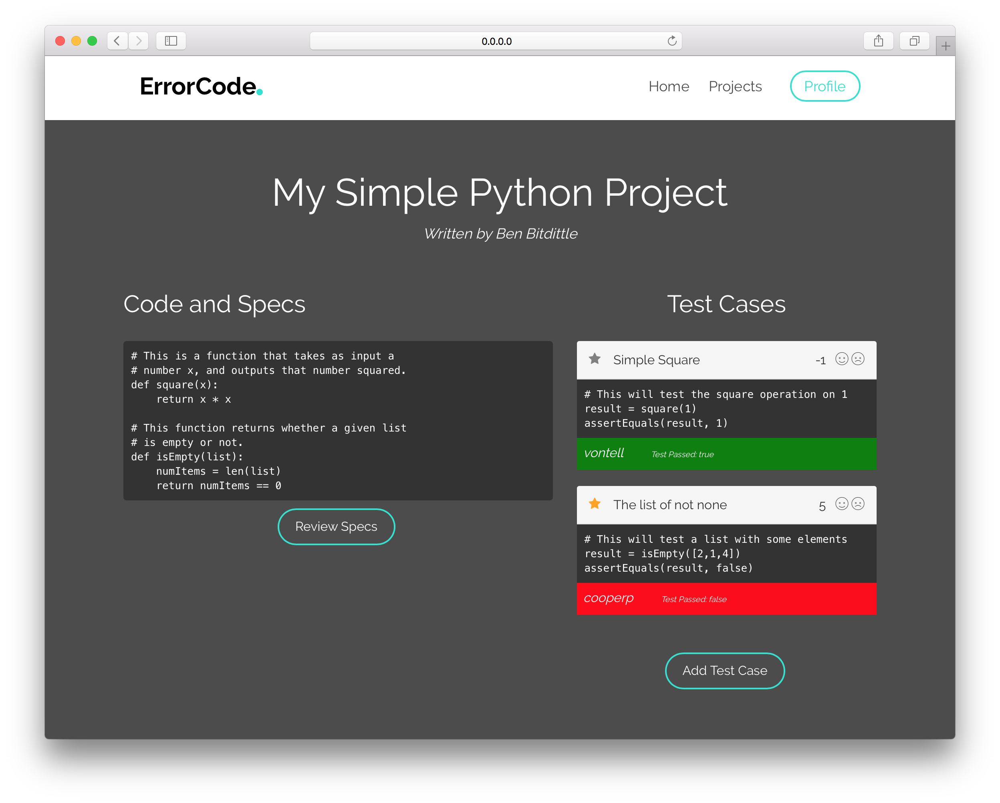

# ErrorCode.
### A product of [HackMIT 2016](https://hackmit.org/).

## Table of Contents
- [Run It](#run-it)
- [Configuration](#configuration)
- [Walkthrough](#walkthrough)

## Run It
Clone this repo and then `cd` into the top of the directory. Run `npm install --save && node app.js`. This will save all of the node modules and begin to run the server. Then go to `0.0.0.0:3000` in your browser to see it running.

## Configuration
If you want to connect this to your own [Firebase](https://firebase.google.com/) or [Square](https://square.com) account just change the [`key.json`](key.json) to your own Firebase key with the proper [privileges](https://firebase.google.com/docs/server/setup). Or change the values in the `JSON` array held in [`config.json`](config/config.json) for the Square account. We use [this](https://github.com/GoogleCloudPlatform/google-cloud-node) node module.

## Walkthrough

We built a service that allows you to upload your *own* code and have other people write test cases for you. It has integration with [Square](https://square.com) to allow you to put bounties on your projects and pay out developers that write test cases. We currently support Python, *but the way which we are running the tests is **not** secure so run this publicly at your own risk.*

When you first load the site it will look like this:

On scroll it has the following:

If you click on "Get Started" button you will be brought here:

Now just upload something and if you click on "SUBMIT" you can see the project page:

Review Specs has some features that are forthcoming but you can see a sample by clicking.

Upload a new test, click "Start Testing" and see the tests pass/fail in real time.

If you click "SUBMIT" you can now see the result of the test on the project page, below.

Lastly, we have a profile page with karma points based on votes on submitted tests (re: smiley faces above the tests on the Project page). This should be reminiscent of Stack Overflow.

